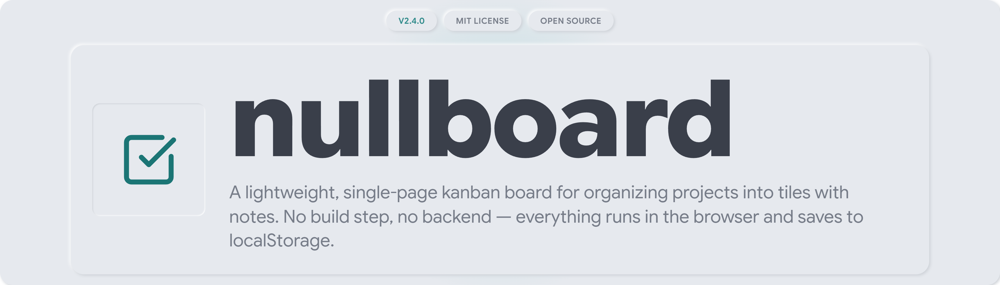

## The Problem

Most kanban tools come with an account wall, a sync service, and a pricing page attached to what's often just three columns and a stack of sticky notes. You don't always need that. Sometimes you want a board that opens in a browser tab, holds your tiles, and gets out of the way.

nullboard is that board. One page, no signup, no server to maintain. It saves everything locally and stays out of your business.

## What's Inside

- **Projects and tiles.** Create a blank project or start from a template. Every tile lands unplaced in the sidebar until you drag it onto a column.
- **Columns.** To Do, In Progress, Awaiting Sign-Off, Completed. Tiles on the board show which project they came from and their tile number.
- **Notes.** Expand a tile and attach free-text notes to it. A badge on the collapsed tile shows the count, so you know at a glance what needs attention.
- **Templates.** Reuse a set of tiles across projects, or define your own with one tile title per line.
- **Themes and text size.** Settings controls an accent color and a font scale from X-Small to X-Large.

## Design Principles

- **No build step.** Three static files, or one bundled file if you'd rather keep a single HTML page on your desktop. Either way, open it and it runs.
- **Local by default.** Projects, tiles, templates, and settings all live in your browser's localStorage. Nothing leaves your machine, and nothing needs a network connection.
- **One visual language.** Tiles, tags, buttons, badges, and inputs pull their radius, shadow, and color from a shared token file rather than scattered one-off styles, with Google Sans Flex as the typeface throughout.
- **Adapts to the screen.** The layout isn't a desktop app squeezed onto mobile. Narrow screens get a collapsible sidebar and swipeable columns.

## Installation

Option A, clone with git:

```bash
git clone https://github.com/BeardedTech0o/nullboard.git
cd nullboard
```

Option B, download as a ZIP. Go to the repository page, click Code, then Download ZIP, and unzip it anywhere on your computer.

Option C, single file, no folder. If you'd rather keep one file on your desktop instead of a folder of three, grab `nullboard.single.html` from the repo (open it and click Download raw file). It's the same app with the CSS and JS bundled inline.

## Running It

The app has no dependencies to install. Serve the folder and open it in a browser, or open `index.html` directly via `file://`. A local server avoids the odd browser restriction, but it isn't required.

Using Python, already installed on most systems:

```bash
python3 -m http.server 8000
```

Then open `http://localhost:8000`.

Using Node.js:

```bash
npx serve .
```

Or skip the server entirely: double-click `index.html`, or open it from your browser with File, then Open.

## Using the Board

Click New Project in the top bar and choose Blank Project or Choose From Template. Double-click any project or tile name to rename it inline. Drag a tile from the sidebar onto a column when you're ready to work on it. Use the icons on a project row to archive or delete it; archived projects stay reachable from the Archived button at the bottom. Open Settings to switch themes or scale text size, or to clear the board while keeping your templates.

## Updating

Your data is keyed to the exact URL or file path you open the app from, not stored inside the files themselves.

If you cloned the repo, run `git pull` and reload from the same path. The origin doesn't change, so your data carries over automatically.

If you're on the single-file bundle, download the latest `nullboard.single.html` and save it over the same file path and filename. Saving to a new location can register as a different origin in some browsers and hide your existing board; if that happens, copy the `ashcombe-kanban-v1` entry from DevTools, Application, Local Storage, on the old file before switching, and paste it in at the new one.

To regenerate the bundle yourself from source, run `node build-single-file.js`.

## Browser Support

Any modern browser (Chrome, Firefox, Safari, Edge) with localStorage and drag-and-drop support.

## Contributing

This is a small, personal tool, so it's tuned to one workflow. If something breaks or you've got an idea worth adding, open an issue.
